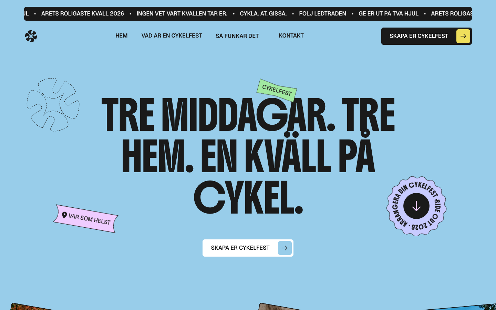

# RideOut — Marketing Site

[](https://github.com/clawmax12-lang/rideout-web/actions/workflows/ci.yml)

Marketing / landing site for the **RideOut iOS app** — a Swedish *cykelfest*
(progressive dinner on bikes). A **self-contained static website**: plain
HTML + CSS + JS + assets, **no build step, no backend**. Deployable to any
static host as-is.



> Origin: a localized + rebranded **Framer "Eventin"** export. It has a few
> important quirks — see **[HANDOFF.md](HANDOFF.md)** before editing so you don't
> break hydration. TL;DR: don't touch the injected `ro-*` blocks blindly, and
> swap managed media in **both** `index.html` and the JS chunk.

---

## Quick start

```bash
# any static server works; this repo ships an npm shortcut
npm run dev          # serves on http://localhost:8770
# or:
python3 -m http.server 8770
```

After editing, **hard-reload** (Cmd/Ctrl+Shift+R) — the hashed `.mjs` chunk is
cached aggressively.

Validate that every referenced asset exists:

```bash
npm run check        # asset-integrity check (also runs in CI)
```

---

## Deploy

It's a static site served from the **repo root** (`index.html` at top level), so
any of these work with near-zero config. Each needs `.mjs` served as
`text/javascript` and long-cache on `/assets/*` — the included configs set both.

| Host | How |
|------|-----|
| **Vercel** | Import the repo. Framework preset **Other**, build command **empty**, output dir **`.`**. `vercel.json` sets headers. |
| **Netlify** | Import the repo. Publish dir **`.`**, no build command. `netlify.toml` + `_headers` set headers. |
| **Cloudflare Pages** | Connect repo. Build command **empty**, output dir **`/`**. `_headers` is applied automatically. |
| **GitHub Pages** | Settings → Pages → Source **GitHub Actions**. `.github/workflows/deploy-pages.yml` deploys on push. *(Pages on a private repo needs GitHub Pro/Team.)* |

---

## Project structure

```
.
├── index.html              # the site (SSR markup + all RideOut customizations)
├── assets/                 # img, media, fonts, scripts (hydration chunk), data, styles
├── docs/                   # repo docs (preview image)
├── scripts/check-assets.mjs# asset-integrity checker (CI)
├── archive/                # original Framer exports + stale build scripts (NOT shipped)
├── HANDOFF.md              # how the Framer export works + maintenance rules (READ THIS)
├── CONTRIBUTING.md         # contribution / editing workflow
├── vercel.json · netlify.toml · _headers   # host configs
└── .github/workflows/      # CI + GitHub Pages deploy
```

> `archive/` holds the two **original Framer exports** (`index.eventin.html`,
> `index.original.html`) and the one-off **rebrand scripts**. They are reference
> only — **not part of the live site**, excluded from deploys and CI. The rebrand
> scripts are **stale**: re-running them regresses the hand-tuned live files.

---

## Maintenance (the short version)

Framer **re-hydrates** the DOM and overwrites direct edits, so all RideOut
changes are **idempotent injected blocks** (`<script id="ro-…">` / `<style>`) that
re-apply on load + a 250 ms interval (+ a `MutationObserver` for the hero). Rules:

- **Don't** hand-edit hydrated DOM and expect it to stick — edit/extend the `ro-*` blocks.
- **Swapping managed media** (img/video): change the path in **both** `index.html`
  *and* the hydration chunk `assets/scripts/*.mjs`, and use a **new filename**.
- Reverting a feature = delete its `ro-*` block.

Full details, the list of customizations, and gotchas: **[HANDOFF.md](HANDOFF.md)**.

---

## Pre-launch checklist

- [ ] **Contact form** is a neutralized stub — wire it to a real endpoint/backend.
- [ ] **Domain**: update `<link rel="canonical">`, `og:url`, and social meta (currently `eventin.framer.website`).
- [ ] **OG/Twitter image + title/description** tuned for the RideOut app.
- [ ] Confirm host serves `.mjs` as `text/javascript` (configs do this).
- [ ] Optional: top marquee still drops Ä/Å on a few words (e.g. "ÄTA" → "AT").
- [ ] Optional: add `robots.txt` `Sitemap:` line + `sitemap.xml` once the domain is set.

---

## License

**Proprietary** — © 2026 RideOut. All rights reserved. See [LICENSE](LICENSE).
